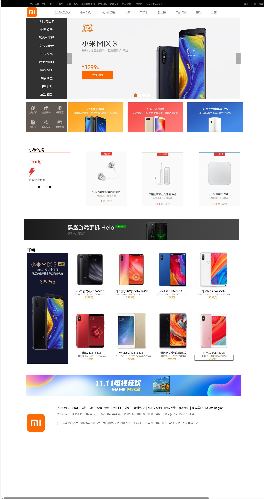
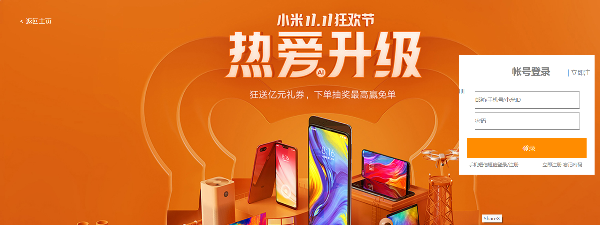

# Web课设小米商城

一个基于 `HTML + CSS + JavaScript + jQuery` 实现的纯前端静态商城项目，整体页面风格参考小米商城官网，适合作为 Web 前端课程设计项目展示。

## 项目预览

### 首页效果



### 登录页面



## 项目简介

本项目以“小米商城”为主题，完成了商城首页、用户登录/注册页，以及多个商品展示页的静态开发。项目通过多页面跳转的方式组织内容，结合图片、视频、轮播图等元素，模拟电商网站的基础展示效果。

这是一个纯前端项目，不依赖后端服务，也没有使用构建工具，下载后即可直接在浏览器中打开查看。

## 功能说明

- 商城首页展示
- 顶部导航与页面跳转
- 轮播图切换效果
- 登录页面
- 注册页面
- 商品分类与详情展示
- 多媒体资源展示（图片、视频）

## 主要页面

- `index.html`：商城首页
- `login.html`：登录页面
- `register.html`：注册页面
- `bijibenmenu.html`：笔记本分类页
- `bijiben.html`：笔记本详情页
- `mi8.html`：小米 8 展示页
- `mix3.html`：小米 MIX 3 展示页
- `tv4c.html`：小米电视 4C 展示页
- `AirPurifierPro.html`：米家空气净化器 Pro 展示页

## 技术栈

- HTML5
- CSS3
- JavaScript
- jQuery 3.1.1

## 项目结构

```text
Web课设小米商城/
├─ index.html
├─ login.html
├─ register.html
├─ bijibenmenu.html
├─ bijiben.html
├─ mi8.html
├─ mix3.html
├─ tv4c.html
├─ AirPurifierPro.html
├─ css/
│  ├─ style.css
│  ├─ my.css
│  └─ mybjb.css
├─ js/
│  ├─ jquery-3.1.1.js
│  ├─ jquery-3.1.1.min.js
│  └─ style.js
└─ img/
   ├─ 页面截图
   ├─ 图片资源
   └─ 视频资源
```

## 运行方式

### 方式一：直接打开

直接双击 `index.html`即可运行。

### 方式二：使用本地服务器

```bash
python -m http.server 8000
```

然后在浏览器访问 `http://localhost:8000`。

## 项目特点

- 采用多页面静态网站结构，适合课程设计展示
- 页面内容较丰富，包含多个商品专题页
- 使用 jQuery 实现基础交互效果
- 不需要安装额外依赖，开箱即用

## 注意事项

- 本项目为静态前端展示项目，不包含真实的登录、注册、下单、支付等后端功能
- 部分页面文字编码可能受原始文件保存格式影响，在不同环境下显示略有差异
- 项目中包含较多图片和视频资源，首次加载时可能稍慢
